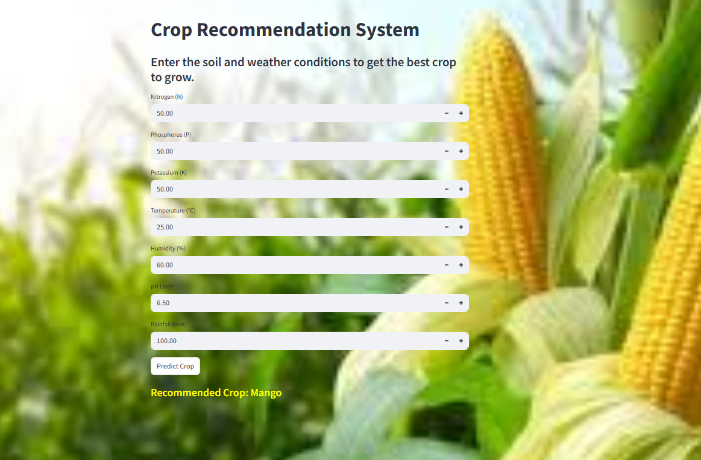
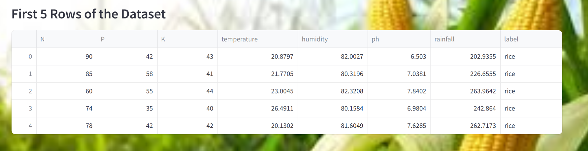
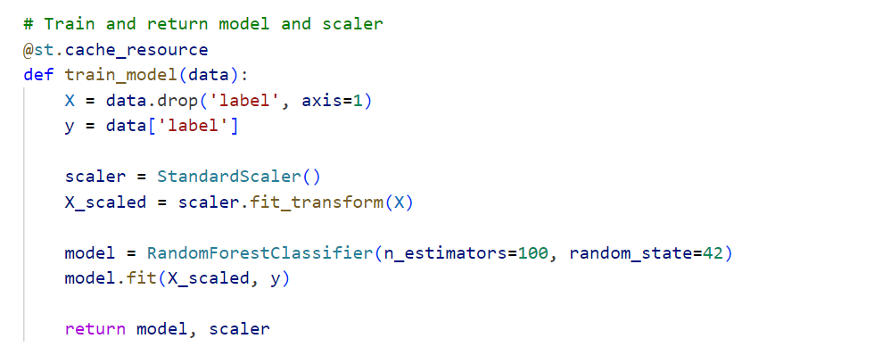
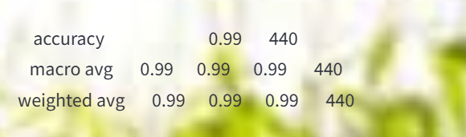

# Crop Recommendation System
This is a Streamlit-based web application that predicts the best crop to grow based on user input of soil nutrients and weather conditions. It uses a trained Random Forest Classifier on the Crop_recommendation.csv dataset.

## Features
Predicts the most suitable crop based on input parameters
 -- Clean UI with a background image for a better visual experience

 -- Uses @st.cache decorators for efficient loading and training

 -- Scaled input features using StandardScaler for better model accuracy

 -- Built with Python, pandas, scikit-learn, and Streamlit

## Dataset Used
File: Crop_recommendation.csv

## Features:

Nitrogen (N)
Phosphorus (P)
Potassium (K)
Temperature (°C)
Humidity (%)
pH level
Rainfall (mm)
Label: Crop name (e.g., rice, maize, apple, etc.)

## Installation & Setup
python -m venv venv
source venv/bin/activate  # On Windows: venv\Scripts\activate

Install dependencies:
pip install -r requirements.txt
Add the dataset and background image
Place Crop_recommendation.csv in the root directory.

## Run the app:
streamlit run app.py

## requirements.txt
streamlit
pandas
numpy
scikit-learn
matplotlib
seaborn

### How to Use
Launch the app in your browser.
Enter the values for:
Nitrogen (N)
Phosphorus (P)
Potassium (K)
Temperature (°C)
Humidity (%)
pH Level
Rainfall (mm)
Click "Predict Crop".
View the recommended crop displayed.

## Customization
Change Background: Replace background.jpg with your own image.
Model Tuning: You can experiment with different ML models like SVM, XGBoost, or LightGBM.
Add More Features: Extend the UI to include EDA visualizations or explainability with SHAP values.

